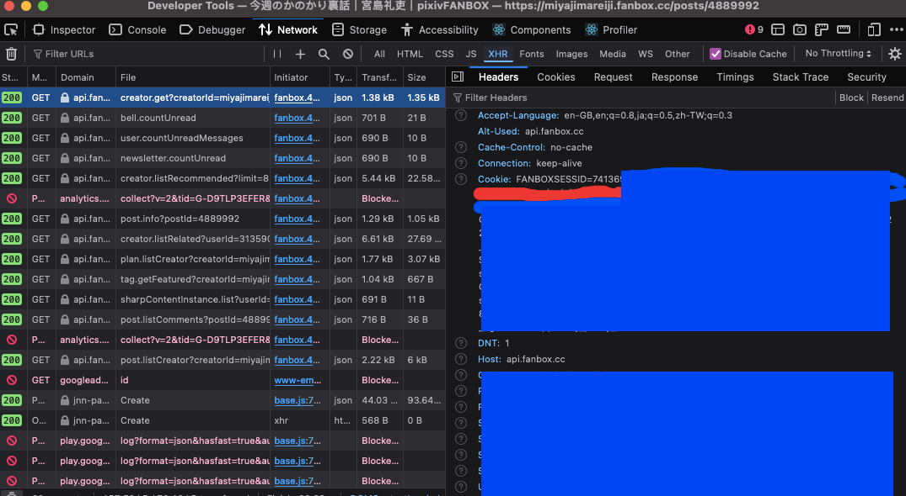

# fanbox-fetch

To fetch images from [Pixiv Fanbox](https://www.fanbox.cc).

## Minimum requirement

* A nodeJS version over 18 to support [fetch API](https://developer.mozilla.org/en-US/docs/Web/API/Fetch_API).
* A cookie from `fanbox.cc` to fetch restricted images.
    * **WARNING**: cookies stores your personal information and registered payment information. Providing cookies to third parties can make them use information improperly and expose your account to risk. See [self-XSS](https://en.wikipedia.org/wiki/Self-XSS) for details.

## Install

1. Download the repo.
2. Copy your cookie into `.env` file like this: `USER_COOKIE=YOUR_COOKIE_AT_FANBOX`.
3. Press `npm install`.

### Cookies

To protect cross-domain abuse, modern web browsers implements [`HttpOnly`](https://owasp.org/www-community/HttpOnly) cookie, that can only retrieve when they request to HTTP server and NOT accessiable by JavaScript.

Therefore, cookies cannot be retrieved from `document.cookie` directly and need to be retrieved manually instead. You can retrieve it from the Network tag of their XHR requests (post.info in particular), as the images below.

Then, copy the value from Network tag to your env file like `USER_COOKIE={cookie}`. Use the `npm env` command if having issues of creating the env file.

## Commands

### `npm start {INPUT}`

* `npm start {THE_AUTHOR}`: Get all images posts form an author. For example, if typing `npm start hiten`, the script will download all scripts from [hiten's images](https://www.fanbox.cc/@hiten) from Fanbox.
* `npm start {URL}`: Download the creation by given URL. For example, typing `npm start https://miyajimareiji.fanbox.cc/posts/4889992` will get the [今週のかのかり裏話](https://miyajimareiji.fanbox.cc/posts/4889992) creation from Fanbox.

### `npm run single {THE_AUTHOR} {THE_POST}`

Format: `npm run single {THE_AUTHOR} {THE_POST}`.

### `npm run json`

To get files by given JSON path.

### `npm run check {THE_AUTHOR}`

To check if the images fetched successfully.

### `npm run test`

To run unit tests.

To test if there're issues of the script, you can use <https://www.fanbox.cc/@miyajimareiji/posts/7211007> (C103 「彼女、お借りします」幻のネーム) to test (`npm start https://www.fanbox.cc/@miyajimareiji/posts/7211007`) the script. The article is accessiable to everyone and you should get two images if no known issues of the script.

### `npm run env {COOKIE}`

To create an `.env` file with cookie.

## License

We use the [ISC license](https://www.isc.org/licenses).
